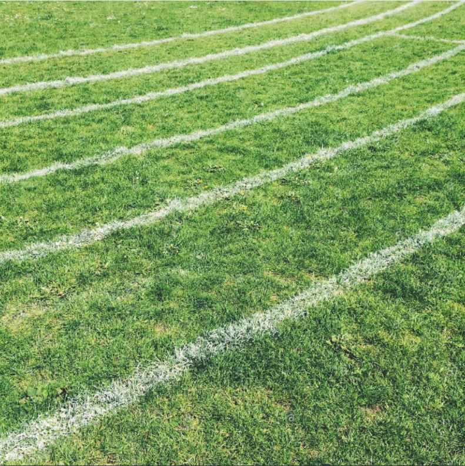
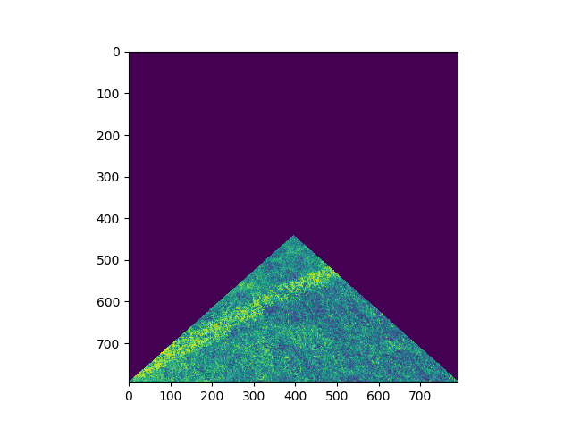
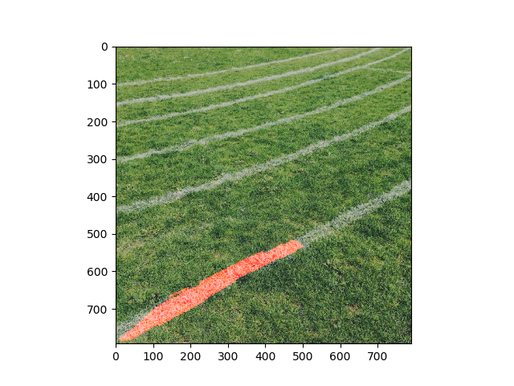

# map_projection
Trying to do copmuter vision and then map it to a 2d plane
Input Videos and corresponding output Videos are in files. If you're interested just download the videos to see the progress that has been made.

# Input Examples

  
   

# Cropped Images

  
   

# Post-Processed Images

  
   

